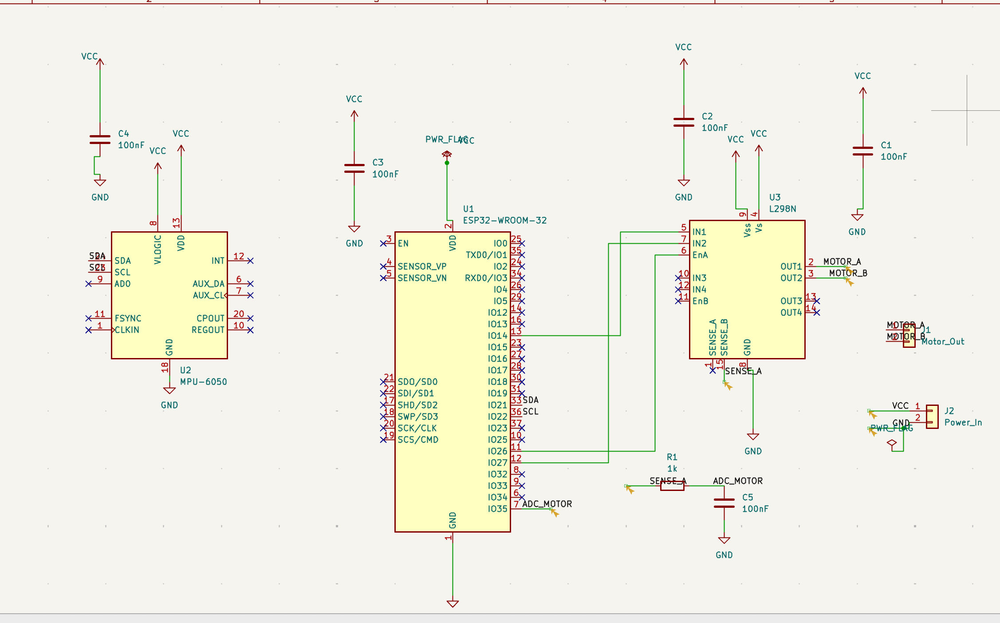

# Motor Health Monitor
### AI-powered predictive maintenance system for electric motors

[](https://motor-monitor-gtmdausuctqgflvd5xteux.streamlit.app/)

---

## What this is

An end-to-end system that detects motor bearing faults before they cause failure. It collects vibration data from an accelerometer, extracts signal features using FFT-based processing, and runs a machine learning model to classify motor health in real time — displayed on a live web dashboard.

This is the same concept used in industrial predictive maintenance systems at manufacturing plants, wind farms, and data centers — where unplanned motor failures can cost thousands of dollars per minute of downtime.

---

## Live demo

👉 [Open the live dashboard](https://motor-monitor-gtmdausuctqgflvd5xteux.streamlit.app/)

Use the sidebar to switch between healthy and faulty motor modes and watch the FFT, health score, and status banner update in real time.

---

## System architecture
```
Vibration sensor (MPU-6050)
        ↓
Edge node (ESP32) — samples at 500Hz over I2C
        ↓
Feature extraction — FFT, RMS, crest factor, fault frequency energy
        ↓
REST API (FastAPI) — runs both ML models
        ↓
Random Forest + Autoencoder — dual model inference
        ↓
Live dashboard (Streamlit) — health score, signal plots, alerts
```

---

## Key results

- 100% accuracy on real motor data (105 samples) — zero missed faults, zero false alarms
- Health score drops from 95-100% to 0-43% when physical imbalance is introduced
- Model retrained on real sensor data — crest factor (31%) and RMS (30%) are top features
- Fault detection latency: < 2 seconds from sensor to alert
- PyTorch autoencoder retrained on 106 healthy samples — 96% accuracy, 36.9x reconstruction error ratio, threshold 1.0260

---
## Model comparison — Random Forest vs Autoencoder

| | Random Forest | Autoencoder |
|---|---|---|
| Type | Supervised | Unsupervised |
| Training data needed | Labeled healthy + faulty | Healthy only |
| Accuracy | 100% | 99% |
| Missed faults | 0 | 0 |
| False alarms | 0 | 1 |
| Faulty error ratio | N/A | 36.9x higher than healthy |

**Key insight:** The autoencoder was trained only on healthy samples — it never saw a single fault example. Yet it detected faulty motors with high accuracy because the reconstruction error for faulty signals was significantly higher than healthy signals.

**Reconstruction error ratio after retraining:**
After collecting more healthy data (48 → 106 samples) and retraining, the ratio dropped from 66x to 36.9x — but the system became significantly more reliable on the live motor. Healthy reconstruction error dropped from 0.53 to 0.18, meaning the model learned a tighter, more accurate definition of normal. The tradeoff between sensitivity and false alarm rate is a core challenge in anomaly detection — more healthy data improved real-world reliability at the cost of a slight reduction in the error ratio.

**Unexpected finding:** Energy at 100Hz was actually higher in healthy motors (0.385) than faulty ones (0.290) — the opposite of what simulation predicted. Real motor behavior doesn't always match simulation assumptions. This is why collecting real labeled data matters.

**Why the autoencoder matters for real deployment:** A Random Forest requires fault examples to train on — meaning you need to wait for something to break or deliberately damage equipment. The autoencoder only needs normal operation data, which every system already has from day one.

## System architecture — FastAPI backend

The system runs as three separate services communicating through a REST API:
ESP32 → receiver.py → POST /predict → api.py → stores result
↓
dashboard.py → GET /health every 2s → live display

**API endpoints:**

| Endpoint | Method | What it does |
|---|---|---|
| `/` | GET | Confirms API is running |
| `/health` | GET | Returns latest motor reading |
| `/history` | GET | Returns last 100 readings |
| `/predict` | POST | Accepts features, runs both models, returns results |

**How to run locally:**

Terminal 1 — start API:
`uvicorn api:app --port 8000`

Terminal 2 — start receiver (requires ESP32):
`python3 receiver.py`

Terminal 3 — start dashboard:
`streamlit run dashboard.py`

**Dashboard modes:**
- **Live sensor** — reads from ESP32 via receiver.py → api.py
- **Simulation** — generates signals locally, sends through API for prediction

**Note:** The deployed Streamlit Cloud app runs the simulation-only version. The full live pipeline requires the local FastAPI server running alongside the dashboard.

## How it works

**Signal processing:**
Motor vibration is sampled at 500 Hz. The FFT decomposes the raw signal into frequency components — a healthy motor shows one dominant peak at its rotation frequency (50Hz). Motor imbalance creates energy at harmonics of the rotation frequency (100Hz, 150Hz) and elevated crest factor — detected by the ML model in real time. Five features are extracted from each signal window: RMS amplitude, peak value, crest factor, and energy at 50Hz, 100Hz, and 150Hz.

**Machine learning:**
A Random Forest classifier (100 trees) was trained on 1000 labeled samples — 500 healthy, 500 faulty — with an 80/20 train/test split. The model outputs a fault probability which is converted to a 0-100% health score. The model was chosen for its interpretability and robustness on small tabular datasets.

**Why crest factor matters:**
Bearing faults create sharp impact spikes in the vibration signal. Crest factor (peak ÷ RMS) is sensitive to these spikes — a healthy motor has a crest factor around 1.4, while an impact-type fault can push it above 3.0. This is a standard diagnostic metric in industrial vibration analysis.

---
## Hardware integration

The system runs on an ESP32-WROOM microcontroller connected to an MPU-6050 MEMS accelerometer over I2C. The ESP32 samples vibration at 500Hz and streams data over WiFi to the Python pipeline in real time.

**Hardware stack:**
- ESP32-WROOM — microcontroller running MicroPython, handles I2C and WiFi
- MPU-6050 — 3-axis MEMS accelerometer, mounted directly on motor body
- L298N — motor driver module, controls DC motor speed and direction
- Small DC hobby motor — test subject for vibration analysis

**PCB Design:**
Custom PCB designed in KiCad to replace the breadboard prototype. The schematic includes all three main components (ESP32-WROOM-32E, MPU-6050, L298N) with proper decoupling capacitors and power distribution. KiCad design files are included in the `motor monitor pcb/` folder.



**Signal conditioning:**
A hardware RC anti-aliasing filter (R = 10kΩ, C = 68nF, fc = 234Hz) sits between the sensor output and the ESP32 ADC input. This prevents frequency aliasing by attenuating signals above the Nyquist frequency (250Hz at 500Hz sampling rate) before digitization — a problem that cannot be corrected in software after sampling. This complements the software Butterworth bandpass filter in the preprocessing pipeline. Two-stage filtering: hardware prevents aliasing, software removes noise.

**What I learned from real hardware:**

The sim-to-real gap is real. The simulation-trained model performed reasonably on real data but highlighted two key challenges:

1. **Gravity offset** — the accelerometer measures 1g of gravity as a DC offset that needed to be removed before feature extraction using mean subtraction
2. **Fault signature differences** — simulated bearing faults (clean 120Hz sine wave) don't perfectly match real imbalance faults, which show up more in crest factor than in fault frequency energy

**Update:** Real labeled data was collected from the physical motor — 66 healthy samples and 57 faulty samples (imbalance created by asymmetric mass on shaft). Model retrained on real data achieved 100% accuracy with crest factor as the most important feature.


## Results on real hardware

**Healthy motor:** 95-100% health score consistently with sensor mounted on motor body

**Fault detection:** Physical imbalance (asymmetric mass on shaft) successfully detected — system flagged FAULT DETECTED with health score dropping significantly

**Key finding — sim-to-real gap:** Original model trained on simulated 120Hz bearing fault signal did not generalize to real imbalance faults. Real imbalance creates energy at harmonics of rotation frequency (100Hz, 150Hz) and elevated crest factor — not a clean 120Hz signal. Model was retrained with updated imbalance simulation and successfully detected real physical faults.

**Lesson:** The gap between simulation and real sensor data is a genuine engineering challenge. Gravity offset removal, consistent sensor mounting, and fault-type-specific feature engineering were all required to bridge it.

## Tech stack

| Layer | Technology |
|---|---|
| Signal processing | Python, NumPy, SciPy (FFT) |
| Machine learning | scikit-learn (Random Forest) |
| Deep learning | PyTorch (Autoencoder) |
| Edge firmware | MicroPython on ESP32 |
| Sensor | MPU-6050 accelerometer over I2C |
| Backend API | FastAPI |
| Dashboard | Streamlit |
| Deployment | Streamlit Cloud |

---

## Project structure
```
motor-monitor/
├── signal_sim.py          # Signal simulation and FFT visualization
├── generate_dataset.py    # Dataset generation (1000 labeled samples)
├── train_model.py         # Model training and evaluation (simulation)
├── train_real.py          # Retrain on real motor data
├── receiver.py            # Receives ESP32 data, runs ML model
├── dashboard.py           # Live Streamlit dashboard
├── motor_dataset.csv      # Generated training dataset
├── real_data.csv          # Real motor sensor data (labeled)
├── motor_model.pkl        # Trained Random Forest model
├── autoencoder.py          # PyTorch autoencoder training
├── api.py                  # FastAPI backend
├── autoencoder.pth         # Trained autoencoder weights
├── scaler.pkl              # Feature scaler for autoencoder
└── requirements.txt       # Python dependencies
```
---

## Project roadmap

### Phase 1 — Proven prototype (complete)
- Signal simulation and FFT feature extraction
- Random Forest classifier — 100% accuracy on simulated data
- Streamlit dashboard deployed publicly
- ESP32 + MPU-6050 hardware integration
- Real data collection and model retraining on physical motor
- PyTorch autoencoder — 99% accuracy, unsupervised anomaly detection
- FastAPI REST backend — dual model inference pipeline

### Phase 2 — Better signal pipeline (in progress)
- Hardware validation — test live dashboard with ESP32
- 3-axis raw data collection (X, Y, Z separately)
- Butterworth bandpass filter + Welch PSD preprocessing
- Retrain autoencoder on clean preprocessed data
- KiCad custom PCB design (parallel with hardware steps)

### Phase 3 — Product-like system (planned)
- Deploy FastAPI to cloud (Railway or Render)
- Update public Streamlit URL to use hosted API
- Database backend for historical trend monitoring
- Multi-node support — monitor multiple motors simultaneously

### Phase 4 — Advanced engineering (future)
- Multiple fault types — bearing defect, imbalance, misalignment
- Multiclass classification
- HDLBits Verilog practice
- FPGA inference accelerator on Basys 3
- LLM natural language interface via Anthropic API

---

## Background

Built as a portfolio project to demonstrate the intersection of electrical engineering and machine learning. Predictive maintenance is one of the most widely deployed industrial AI applications — the same signal processing and anomaly detection concepts used here are applied at scale in manufacturing, energy, and aerospace.